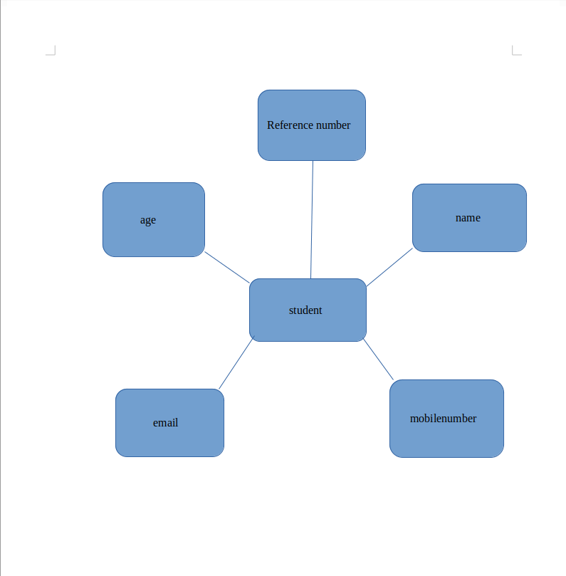
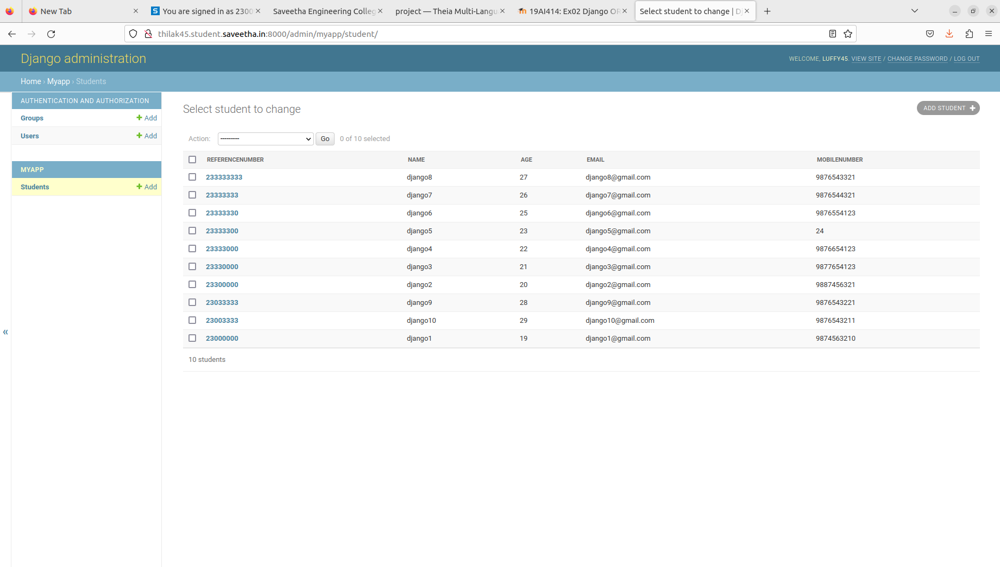
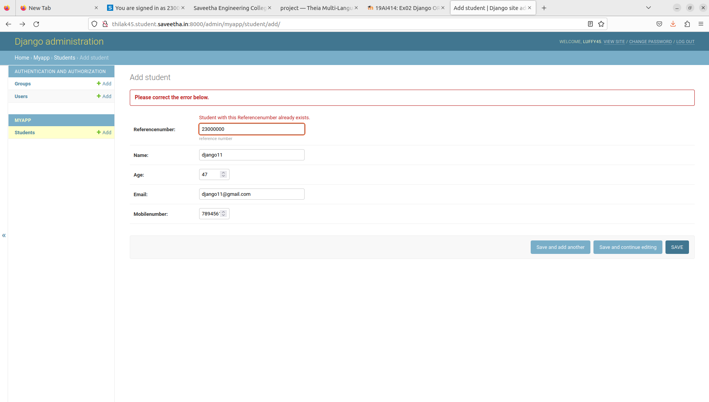

# Django ORM Web Application

## AIM
To develop a Django application to store and retrieve data from a database using Object Relational Mapping(ORM).

## Entity Relationship Diagram



## DESIGN STEPS

### STEP 1:
creating a table using required details in Django-ORM
### STEP 2:
upload the python code.
### STEP 3:
push the code to github.

## PROGRAM
### models.py
```py
from django.db import models
from django.contrib import admin

class Student (models.Model):
    referencenumber=models.CharField(primary_key=True,max_length=20,help_text="reference number")
    name=models.CharField(max_length=100)
    age=models.IntegerField()
    email=models.EmailField()
    mobilenumber=models.IntegerField()

class StudentAdmin(admin.ModelAdmin):
    list_display=('referencenumber','name','age','email','mobilenumber')
```

### admin.py
```py
from django.contrib import admin
from .models import Student,StudentAdmin

admin.site.register(Student,StudentAdmin) 
```          

## OUTPUT

### student list:


### student error:



## RESULT
The Programme is Executed successfully.